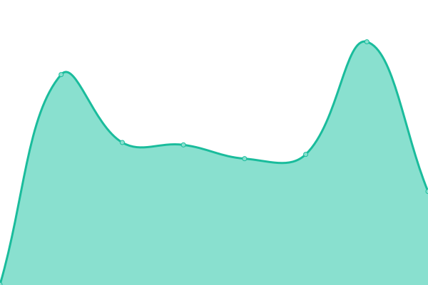

# [📈 Live Status](https://upptime.github.io/upptime): <!--live status--> **🟩 All systems operational**

This repository contains the open-source uptime monitor and status page for [Upptime](https://upptime.js.org), powered by [Upptime](https://github.com/upptime/upptime).

With [Upptime](https://upptime.js.org), you can get your own unlimited and free uptime monitor and status page, powered entirely by a GitHub repository. We use [Issues](https://github.com/upptime/upptime/issues) as incident reports, [Actions](https://github.com/sensebox/upptime/actions) as uptime monitors, and [Pages](https://upptime.github.io/upptime) for the status page.

<!--start: status pages-->
<!-- This summary is generated by Upptime (https://github.com/upptime/upptime) -->
<!-- Do not edit this manually, your changes will be overwritten -->
<!-- prettier-ignore -->
| URL | Status | History | Response Time | Uptime |
| --- | ------ | ------- | ------------- | ------ |
|  [senseBox](https://sensebox.de) | 🟩 Up | [sense-box.yml](https://github.com/sensebox/upptime/commits/HEAD/history/sense-box.yml) | 

 502ms
     
 | 

<a href="https://status.sensebox.de/history/sense-box">100.00%</a>
    

|  [senseBox Docs](https://docs.sensebox.de) | 🟩 Up | [sense-box-docs.yml](https://github.com/sensebox/upptime/commits/HEAD/history/sense-box-docs.yml) | 

 297ms
     
 | 

<a href="https://status.sensebox.de/history/sense-box-docs">100.00%</a>
    

|  [Blockly](https://blockly.sensebox.de/ardublockly/?board=sensebox-mcu) | 🟩 Up | [blockly.yml](https://github.com/sensebox/upptime/commits/HEAD/history/blockly.yml) | 

 222ms
     
 | 

<a href="https://status.sensebox.de/history/blockly">100.00%</a>
    

|  [Blockly API](https://api.blockly.sensebox.de/tutorial/) | 🟩 Up | [blockly-api.yml](https://github.com/sensebox/upptime/commits/HEAD/history/blockly-api.yml) | 

 731ms
     
 | 

<a href="https://status.sensebox.de/history/blockly-api">100.00%</a>
    

|  [openSenseMap](https://opensensemap.org) | 🟩 Up | [open-sense-map.yml](https://github.com/sensebox/upptime/commits/HEAD/history/open-sense-map.yml) | 

 636ms
     
 | 

<a href="https://status.sensebox.de/history/open-sense-map">99.84%</a>
    

|  [openSenseMap API](https://api.opensensemap.org) | 🟩 Up | [open-sense-map-api.yml](https://github.com/sensebox/upptime/commits/HEAD/history/open-sense-map-api.yml) | 

 483ms
     
 | 

<a href="https://status.sensebox.de/history/open-sense-map-api">99.49%</a>
    

|  [openSenseMap Archive](https://archive.opensensemap.org/) | 🟩 Up | [open-sense-map-archive.yml](https://github.com/sensebox/upptime/commits/HEAD/history/open-sense-map-archive.yml) | 

 1019ms
     
 | 

<a href="https://status.sensebox.de/history/open-sense-map-archive">99.55%</a>
    

|  [Compiler](https://compiler.sensebox.de/compile) | 🟩 Up | [compiler.yml](https://github.com/sensebox/upptime/commits/HEAD/history/compiler.yml) | 

 925ms
     
 | 

<a href="https://status.sensebox.de/history/compiler">100.00%</a>
    

<!--end: status pages-->

[**Visit our status website →**](https://upptime.github.io/upptime)

## 📄 License

- Powered by: [Upptime](https://github.com/upptime/upptime)
- Code: [MIT](./LICENSE) © [Upptime](https://upptime.js.org)
- Data in the `./history` directory: [Open Database License](https://opendatacommons.org/licenses/odbl/1-0/)
